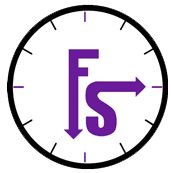

## Proyecto final UYA - Focus on Study</h1>

  

  Enlace a página web: <a href="https://alu0101216126.github.io/Proyecto-Final-UYA/index.html">https://alu0101216126.github.io/Proyecto-Final-UYA/index.html</a>

  

<h3 align="center">MaterializeCSS</h3>

  Materialize, a CSS Framework based on material design.

## Miembros

<ul>
  <li>Daniel Álvarez Medina</li>
  <li>Dayana Armas Alonso</li>
  <li>Alberto Mendoza Rodríguez</li>
  <li>Yago Pérez Molanes</li>
</ul>